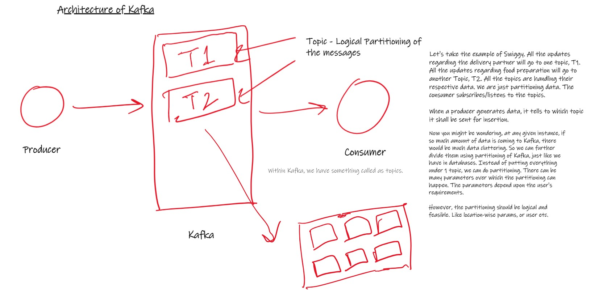
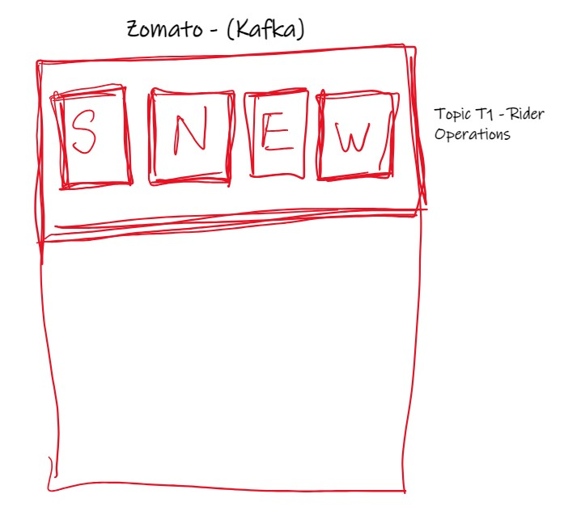
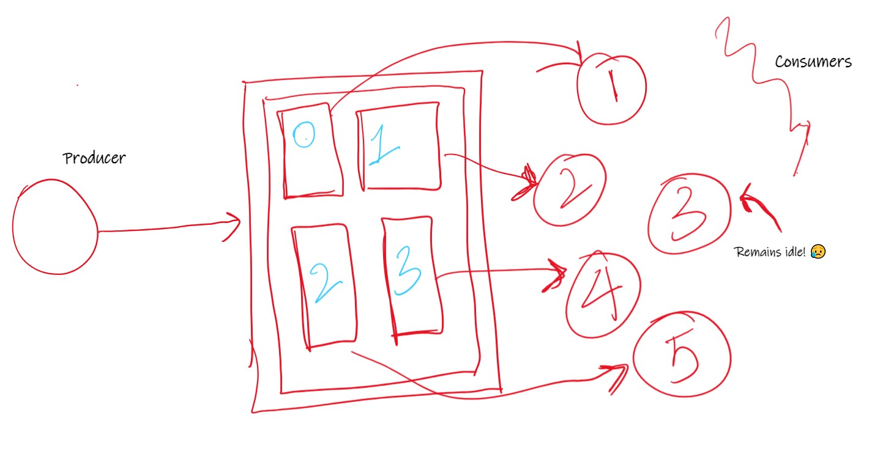
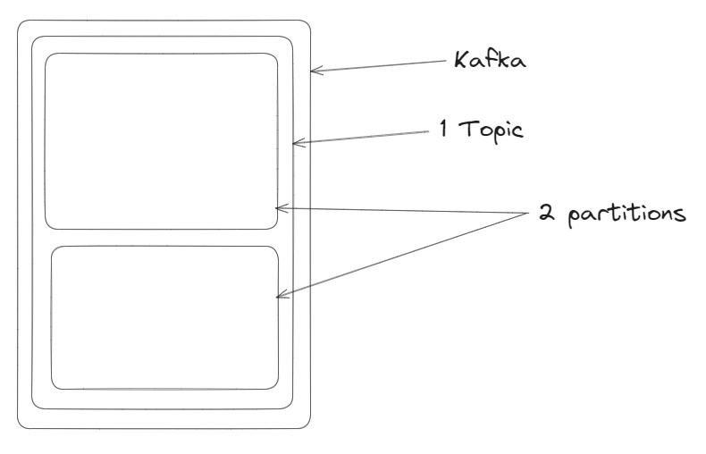
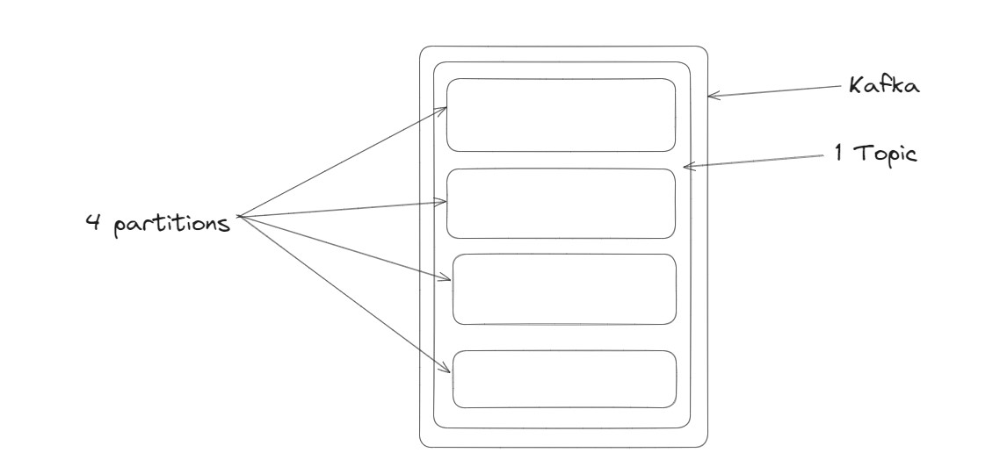

In today's digitally connected world, real-time systems play a crucial role in delivering live data and instant updates to users. Let's take a familiar example: Uber, used by millions worldwide. When you book a ride, you're provided with real-time updates on your driver's location. Ever wondered how this magic happens? In this blog, we'll demystify the role of Kafka in real-time systems and its importance in delivering such seamless experiences.

## The Challenge: Handling Massive Data Influx

Consider this scenario: Uber has at least 50,000 users at any given moment. Every second, each of these users generates live location data, and this data needs to be processed, stored, and delivered to users promptly. This presents a colossal challenge for databases, no matter how robust they are. Even database heavyweights like PostgreSQL, MongoDB, DynamoDB, or ScyllaDB would struggle because they have limitations in terms of throughput.

**What's Throughput?**
In simple terms, throughput is the capacity to handle a large number of read and write operations in a given time frame. Databases, while excellent for structured data storage, fall short in terms of handling a high number of write operations in real-time.

#### The Kafka Solution
This is where Kafka, our hero, comes into play. Kafka boasts high throughput, meaning it can efficiently manage a massive number of read and write operations in a short timeframe, whether it's 1,000, 10,000, or even a million per second.

Now, you might be thinking, "Why don't we use Kafka for everything?" The answer lies in Kafka's Achilles' heel: storage capacity. Kafka is not designed for long-term data storage; it can only retain data for a short period. On the flip side, databases excel in long-term data storage, and you can perform complex queries on the stored data.

In the above scenario, where Uber generate bulk of data, this data is sent to servers for Analysis, Fare Report and Customer Report. 
After some calculation is done on the data by these servers, at once all these data is bulk inserted(all at once) to the database.
All in one transaction. This bulk insert might take some time. Still it is not an issue.  

**The Perfect Duo: Kafka and Databases**
The ideal architecture combines Kafka and databases. Kafka handles high-throughput data ingestion and real-time distribution, while databases shine in long-term data storage, query performance, and support for CRUD (Create, Read, Update, Delete) operations.

### Architecture of Kafka: 

Let's take the example of Swiggy. All the updates regarding the delivery partner will go to one topic, T1. All the updates regarding food preparation will go to another Topic, T2. All the topics are handling their respective data. We are just partitioning data. The consumer subscribes/listens to the topics. 

Topic - Logical Partitioning of the messages. 
Definitive: a topic is a fundamental concept that represents a category or feed name to which records are published. It serves as the primary mechanism for organizing and segregating the flow of data. Producers publish messages to a topic, and consumers subscribe to topics to receive and process those messages.

As I have mentioned above, Topic T1 will keep the updates on the delivery partner and Topic T2 can receive the data for food preparation from the Hotel/Restaurant.

This is the partitioning of data. 

The consumer subscribes to these topics and listens to them.

When a producer generates data, it tells to which topic it shall be sent for insertion. 

The producer produces the topic and while sending it, it decides within which topic, it has to send the data.

Now you might be wondering, at any given instance, if so much amount of data is coming to Kafka, there would be much data cluttering. So we can further divide them using partitioning of Kafka, just like we have in databases. Instead of putting everything under 1 topic, we can do the partitioning. There can be many parameters over which the partitioning can happen. The parameters depend upon the user's requirements. 

However, the partitioning should be logical and feasible. Like time, location-wise params, or user etc. depending upon your application. 

Lets say for this Kafka, we are partitioning Topic T1, *rider-updates* on the basis of Regions. One for South India and the other for North India. This helps us in dividing it into chunks. 

Diving a bit technical into Kafka, below consider a Kafka server, and within that we only have 1 Topic. And that topic is divided into 4 partitions, indexed as 0, 1, 2 and 3. And you write some logic as how the data will be divided into these partitions. 

Now, here we will take just one producer, that produces huge amount of data. At the time of producing the data, we will write some logic as how the data will be divided into these partitions.

Let's say we just have 1 consumer, then it will automatically consume all the partitions. (Auto-balancing) 
But we have 2 consumers, Kafka will auto-balance, dividing the partitions between the 2 consumers.
Now if 3 consumers, then it will be divided into 2:1:1 ratio.
For 4 consumers, it will be divided into 1:1:1:1 ratio.

But if there are 5 consumers?? Here the 5th consumer will be idle, as we have 4 partitions only. 

Lets say we have a kafka, with 1 topic and 2 partitions.   

    

Lets say we have 1 consumer only. In that case we both the partitions will be consumed by the single consumer. 
Now another consumer arrives at the scene. At this case, Kafka will auto-balance the partitions between the 2 consumers.
Each will get 1. 

What if we have 3 consumers? In that case, 2 consumers will get 1 partition each and the 3rd consumer will be idle.

But what if we specify or force Consumer 3 to consume anyone of the two partitions. Will it be possible? No. 
Because in Kafka, 
**1 Consumer** can only **consume multiple partitions**, but **1 partition can only be consumed by 1 consumer**.

Here we get introduced to consumer groups. 

### Consumer Groups
Lets say we have a Kafka, 1 topic and 4 partitions. 

    

Lets assume there is a consumer group, CG1 and currently there is just just 1 consumer C1 in that group.
Now 3 more consumers, C2, C3 & C4 arrive to CG1. Each will be assigned 1 partition each.
Now if C5 arrives to CG1, it will be idle. Because we have 4 partitions only, 4 consumers are already consuming them.

What if we make another group, CG2 and add C5 to it? In that case, C5 will consume all the 4 partitions.
Self balancing will assign all the 4 partitions to C5 in CG2. 

**This means that self balancing happens at group level**. 

What is it's advantage?
This allows Kafka to use Queue and Publish-Subscribe(Pub-Sub) model at the same time using Consumer Groups.

Lets say in a partition we have 4 partition. 1 consumer group, CG1 and 4 consumers, C1, C2, C3 & C4.

Each partition will be consumed by 1 consumer each. Which makes it a queue. No of consumers = No of partitions.

To make it a Pub-Sub model, we can add another consumer group, CG2 and add 4 consumers, C5, C6, C7 & C8.

Now each consumer will consume all the 4 partitions.
