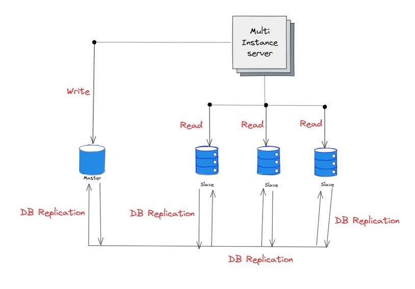
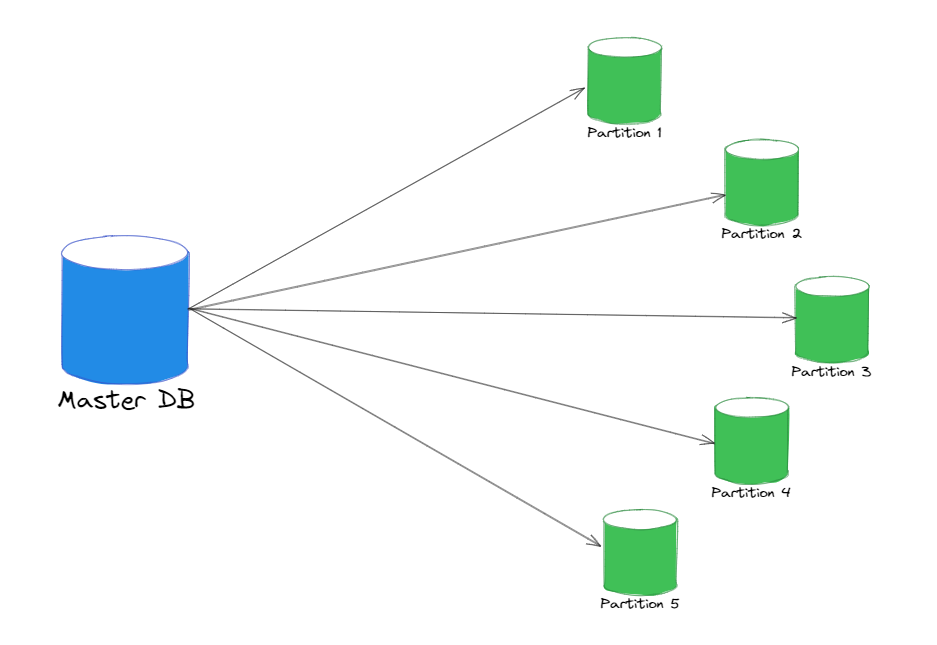

In the ever-expanding digital landscape, managing large volumes of data efficiently has become a key challenge for businesses. 
Database scaling techniques play a pivotal role in optimizing performance, ensuring fault tolerance, and enhancing the overall user experience. 
Let's delve into the intricacies of three popular database scaling methods: 
- Sharding,
- Replication, and
- Partitioning.

## Database Sharding

Sharding is a way you scale your databases horizontally. And when we say scaling horizontally, we mean adding more machines or servers to your network to handle increased demand or workload.

It is a type of database partitioning in which a large dataset is divided or partitioned into smaller data or different nodes across multiple databases, stored across multiple machines. A single database can store and process only a limited amount of data. To overcome this limitation, we split the data into smaller chunks, also known as shards, stored across several database servers. 

By dispersing data across multiple machines, a sharded database becomes capable of managing a higher volume of requests compared to what a single machine could handle. This distributed approach enhances the database's capacity and responsiveness, accommodating increased demand more effectively.

It also becomes easier to manage the data as it is distributed across multiple machines. For example, if you want to delete a particular user's data, you can do so by deleting the data from the shard that contains the user's data. This way, you don't have to delete the data from the entire database. (making data management easier)

#### Need for Sharding?
When an application grows, the number of users and the data that is stored also grows rapidly. This can lead to a lot of problems like:
- Slow response time
- High latency
- High load on the database
- High cost of scaling vertically

As a result, the database becomes a bottleneck for the application. Overall performance of the application is affected and has a big impact on the user experience.

To put things into perspective, imagine this scenario where an online marketplace started as a small boutique and quickly grew into a global shopping extravaganza. As the product catalogue expands and user traffic soars, the database that once powered the platform now finds itself gasping for breath. This is where the magic of database sharding unfolds. 

In this scenario, sharding steps in as the superhero of scalability. Picture the database as a giant warehouse storing product details, customer information, and transaction history. Sharding breaks down this massive database into smaller parts, like dividing the warehouse into sections. Each part (or shard) deals with specific groups of products or customers. So when people browse, search, or buy, the workload is spread across these sections, preventing the database from getting overwhelmed. Sharding makes sure your online store not only survives but also runs smoothly, giving customers quick and responsive experiences, especially during busy shopping times.

#### How does Sharding work?
In a sharded database system, data is strategically divided into shards based on predetermined criteria such as time, categories, location, or customer segments. Following partitioning, the data is distributed across multiple servers or nodes, with each server or node handling storage and processing for a specific subset of the data.

To retrieve information from the sharded database, the system relies on a shard key - a unique identifier used to map data to its designated shard. When a query is initiated, the system utilizes the shard key to identify the shard containing the relevant data and then directs the query to the corresponding server or node.

This sharding mechanism enhances the system's scalability and performance by distributing the data processing workload among multiple servers, ensuring efficient data management and retrieval.

Now let's take the above scenario of the online marketplace and see how sharding can help in scaling the database.

In the above case, the database is a giant warehouse responsible for storing product details, customer information, and transaction history. Each shard takes charge of specific groups of products or customers, ensuring that when users browse, search, or make purchases, the workload is seamlessly spread across these sections. This prevents your database from feeling like it's caught in a shopping frenzy, ensuring your online store not only survives but thrives with quick and responsive experiences—especially during those peak shopping moments.

The best approach would be dividing the database into certain schemes such as product categories, customer locations, or other logical segments. Each shard then becomes a specialized area, handling specific types of products or catering to particular customer groups. This way, the database remains agile and responsive, effortlessly managing the growing demands of the app.

#### Do you actually need database sharding? 🤔
Sharding a database, like any distributed architecture, involves inherent costs such as setup complexities, ongoing maintenance for each shard, and efficient request routing. Prior to embarking on a sharding strategy, it's prudent to explore alternative solutions that might suit your needs.

1. **Vertical Scaling**: 
Opting for vertical scaling allows you to enhance performance without the intricacies of sharding. Simple upgrades like increasingRAM, improving CPU capabilities, or expanding storage offer streamlined solutions without necessitating changes to your database orapplication architecture. Visualizing vertical scaling eliminates the need for sharding complexities.  

2. **Specialized Services or Databases**:
Depending on your use case, outsourcing specific functionalities to other providers or separate databases could be a more practicalsolution. For instance, offloading blob or file storage to a cloud service like Amazon S3, or utilizing specialized services foranalytics or full-text search, can be more efficient than the comprehensive approach of sharding your entire database.  

3. **Replication**: 
If your data workload leans towards read-centric operations, replication emerges as a viable option to enhance availability and readperformance. This can be achieved by creating additional copies of the database, facilitating improved read performance through loadbalancing or geo-located query routing. We will explore replication in greater detail in the next section.  

However, if your primary database contends with substantial data volumes, high read and write frequencies, and specific availability prerequisites, opting for a sharded database may be the most suitable course of action. Let's delve into the merits and drawbacks of implementing a sharding strategy.

#### Features: 
- Streamlined databases for quicker and more efficient management.
- Decreases transactional volume and expenses, thereby enhancing overall performance.
- Each shard independently manages its own data through read and write operations.
- The failure of one shard does not impact the data processing capabilities of other shards.

#### Benefits: 
- Enhanced Performance and Scalability:
    * Sharding allows your system to effortlessly handle larger amounts of data and increased user requests by horizontally scaling, adding more servers or nodes.
    * This distribution of data across multiple servers optimizes performance, ensuring quicker response times and improved overall throughput.

- Fault Tolerance and Avoidance of Service Outages:
    * Sharding ensures fault tolerance as the system continues to function even if one or more servers or nodes encounter issues.
    * In the event of a server failure, the distributed nature of sharding prevents total service outages, as other functional shards can seamlessly handle operations. Combining sharding with data replication further safeguards against data loss.

- Cost-Effective Scaling:
    * Database sharding facilitates cost-effective scaling by allowing the addition of more computing resources without the need for expensive hardware upgrades.
    * This horizontal scaling, achieved by adding new shards dynamically, enables efficient database growth without requiring application downtime for maintenance.

## Database Replication:
Database Replication is the practice of creating and storing copies of the database  
*OR*  
Database replication is like making electronic copies of data from one database to another. This ensures that all users have the same information. It's like having a shared database where everyone can access the data they need without causing issues for others. This process makes data easily available to users for their tasks. Creating and managing database replication involves various elements that work together to keep information consistent across different locations. 

Database replication is like a continuous update. When a user modifies data in the main database, those changes automatically sync to all replicated databases. This ensures that users always have the most up-to-date and accurate information to work with. It's a way of keeping everyone on the same page in real-time.  

In today's businesses, applications handle a lot of important tasks and store crucial data. However, traditional in-house servers sometimes struggle to manage the increasing demands. This can hinder your company's ability to scale processes and perform real-time analysis, transformations, and visualizations on your data. Here DB Replication comes handy. 

Database replication can be used in many database management systems, usually with a master/slave relationship between the original and the copies. A master database generally only supports write operations. A slave database only gets copies of the data from the master and only supports read operations. 

All the Data Modification Language (DML) operations like *INSERT*, *UPDATE*, *DELETE* are performed on the master database. The changes are then propagated to the slave databases. 

Most applications require a much higher reads to write ratio. So, the number of slave databases in a system is usually much higher than the number of master databases.

##### Understanding the above architecture:
If one of the slave DBs goes down, the application can still read data from the other slave DBs. This ensures that the application is always available to the users. **But if there is only 1 Slave and 1 Master DB**, then the read operations will be redirected to the master DB, until the issue is found and the slave is brought back up or replaced. 

If the master goes down, a slave database will be promoted to the new master. All the database operations will be re-directed to the new master. This ensures that the application is always available to the users. In production systems, promoting a new master is more complicated as the data in a slave database may not be up to date. 

Although some other replication methods like multi-masters and circular replication could help, these setups are complicated.

#### Need for Database Replication?
- **Enhanced Performance and Availability**:
    * Database replication improves system performance by distributing data across multiple locations, reducing load on any single database.
    * Ensures high availability as users can access replicated data even if one server experiences downtime.

- **Real-Time Data Access**:
    * Enables users to work with the latest data as changes made in the source database are instantly synchronized with replicated databases. 
    * Facilitates real-time decision-making and operations.

- **Fault Tolerance and Disaster Recovery**:
    * Acts as a safeguard against data loss and system failures by maintaining copies of data in different locations.
    * Provides a robust disaster recovery mechanism, allowing for quick restoration of data in case of unexpected events.

- **Load Balancing for Optimal Performance**:
    * Facilitates load balancing across servers, ensuring even distribution of user requests and preventing performance bottlenecks
    * Optimizes resource utilization and response times.

#### How does Database Replication works?
Imagine it as a synchronized dance of information – when a user updates or modifies data in the primary/master database, these changes are automatically mirrored or replicated in secondary/slave databases. This constant syncing guarantees that all users, no matter where they are accessing the data, are working with the most recent and accurate information. It's like having instant access to a real-time, shared pool of data.

The technical aspect involves the continuous transmission of data changes from the source/master database to its replicas. This process is essential for maintaining consistency and avoiding discrepancies between different instances of the database. Each replicated database is a mirror image of the original, ensuring a harmonious flow of information. This not only enhances accessibility for users but also contributes to fault tolerance. If one database encounters an issue, others seamlessly take over, providing uninterrupted access to critical data.

Database replication plays a crucial role in enhancing performance and reducing the load on the primary database server. By distributing the workload across multiple replicas, the system ensures optimal response times, improved throughput, and an overall smoother user experience. It's a strategic approach to scaling your data infrastructure horizontally, allowing for increased capacity without the need for substantial hardware upgrades.

In essence, database replication is the backbone of a robust and responsive data management system. It empowers businesses with the agility to handle growing data volumes, maintain data integrity, and offer users a consistently reliable experience.

-------------------------------------------------------------------

#### Advantages: 
- **Better Performance**: 
In the master-slave model, all writes and updates happen in master nodes, whereas read operations happen in read nodes. This improves performance because it allows more queries to be processed in parallel.

- **High Availability**:
By Replication databases across different locations, we can ensure that the data is available even if one of the servers goes down. This is because the data is replicated across multiple servers. So, if one server goes down, the data can be served from another server.

- **Reliability**:
Replication of data across multiple servers ensures that the data is not lost even if one of the servers goes down due to a natural disaster or some cause. This is because the data is replicated across multiple servers and locations. So, if one server goes down, the data can be served from another server.

## Database Partitioning:

Database partitioning serves as the foundation for contemporary distributed database management systems. This process involves breaking down a sizable dataset into smaller partitions distributed across various machines. Essentially, it's a method of segmenting data, such as tables or index-organized tables, into more manageable pieces to facilitate efficient access and management.

The objective is to enhance database availability, scalability, and query processing performance by dispersing data across multiple partitions. Despite this distribution, the combined data across all partitions remains identical to the data in the original database.

Crucially, the partition architecture operates seamlessly for the client application. From the client's perspective, interactions with the database partitions occur as if communicating with a singular database, despite the underlying distributed structure. This ensures a transparent and user-friendly experience for applications interacting with the partitioned database.

Now a question might be arising in your mind, *isn't it the same as sharding*? 
While both database partitioning and sharding involve the distribution of data for improved performance and scalability, they differ in key aspects. Database partitioning is a broader concept that encompasses various methods, <u>one of which is sharding</u>. 
Sharding specifically involves horizontal partitioning, where subsets of data (shards) are spread across different servers. In contrast, database partitioning encompasses a range of techniques, including vertical partitioning, hash partitioning, and range partitioning, providing more flexibility in how data is segmented. 
Additionally, database partitioning often involves a centralized control mechanism, ensuring a cohesive approach to data management. On the other hand, sharding may operate with decentralized control, granting more autonomy to individual shards. Therefore, while sharding is a specific type of database partitioning, database partitioning as a whole offers a more comprehensive and versatile approach to optimizing database management.

#### Need for Database Partitioning?
- **Enhanced Availability and Fault Tolerance**:
    * By partitioning the database, we fortify the high availability of our application. Each partition operates independently, ensuring that if one partition experiences issues, others can seamlessly execute queries. 
    * This proactive approach mitigates the risk of a single point of failure, significantly bolstering the overall reliability and availability of the service.

- **Efficient Backup, Recovery, and Scalability**:
    * Data partitioning facilitates independent backup and recovery operations for each partition. This means quicker restoration of the active partition, enabling continued system access while inactive data is being recovered. 
    * As hardware capacities have limits, data partitioning allows for scalable service growth by distributing data across multiple partitions, eliminating scalability constraints that may impede performance as traffic 

- **Security and Performance Optimization**: 
    * Beyond availability and scalability, data partitioning improves security by segregating sensitive and non-sensitive data into different partitions. This not only enhances data management but also provides heightened security for sensitive information. 
    * The system's ability to query smaller components rather than the entire database improves overall performance, ensuring swift and efficient data retrieval.

    

#### Kinds of Database Partitioning:
- **Horizontal Partitioning/Sharding**:
The approach of horizontal partitioning, commonly known as sharding, involves dividing a dataset based on rows or records. Each partition holds a specific subset of rows, and these partitions are typically spread across multiple servers or storage devices. This technique is prevalent in distributed databases, enhancing parallelism and facilitating load balancing to optimize overall system performance.

- **Vertical Partitioning**:
In contrast to horizontal partitioning, vertical partitioning segments the dataset based on columns or attributes. Here, each partition contains a distinct subset of columns for every row. This method proves valuable when different columns exhibit varied access patterns or when certain columns are accessed more frequently than others. It offers a tailored approach to data organization based on the characteristics of individual columns.

- **Hash-based Partitioning:**
Hash-based partitioning involves scrutinizing data using a hash function to determine its designated division. The data undergoes the hash function, generating a hash value that dictates the categorization into a specific partition. This method, by distributing data randomly across partitions, aids in load balancing and expedites data retrieval. Hash-based partitioning is particularly effective in scenarios where a dynamic and balanced distribution of data is crucial for optimal system functioning.

- **Key-based Partitioning:**
In key-based partitioning, data is systematically divided based on a specific key or attribute value, providing a structured approach to dataset organization. Each partition is designed to encompass all data associated with a particular key value. This method finds frequent application in distributed databases or systems where even distribution of data is crucial for optimal performance. Key-based partitioning facilitates efficient data retrieval through key lookups, streamlining the process and ensuring that relevant information is readily accessible.  

