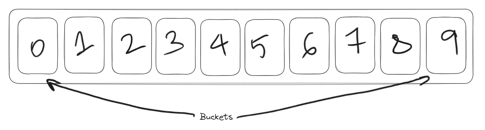
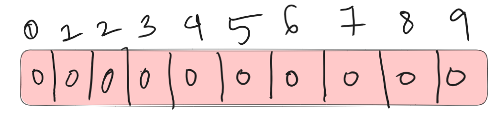
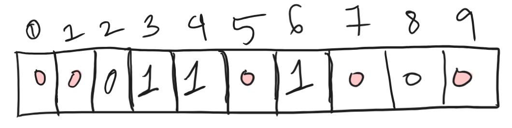
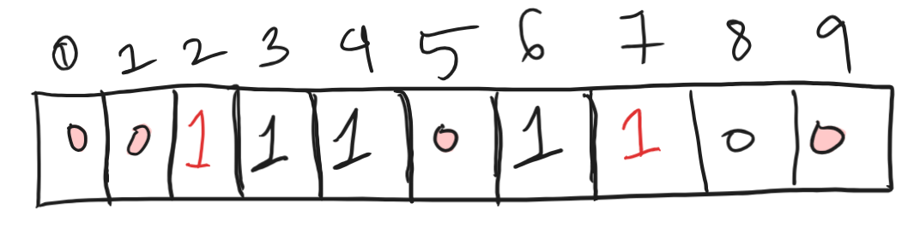

Now let's imagine this case where you are creating a new Instagram account. 
You enter a username. But a message pops up below saying that the username is already taken.
You added your favourite number to the username and tried again. But the same message popped up again.
But now you added some random special characters to the username and tried again, yet the same message popped up.

Really frustrating, isn't it? But have you ever wondered how does Instagram check if the username exists or not so quickly? 🤔
How does it check through the millions of registered usernames so quickly?

Well, there are many ways to do this. 

a. Linear Search?? 🤔 Worst idea. With a time complexity of O(n), it will take forever to search through millions of usernames.

b. Binary Search?? 🤔 
We can store the names in alphabetical order. Then we can use binary search to search for the username.
Better than linear search, but still not good enough. With a time complexity of O(log n), it will still take a lot of time to search through millions of usernames. 

c. Hashing?? 🤔
We can store the usernames in a hash table. Then we can search for the username in O(1) time.
But there is a problem. Hash tables are not space efficient. They take up a lot of space.

So what do we do????
Bloom Filters to the rescue!! 🎉
Bloom Filter is a data structure that can do this job for us. 
But before understanding bloom filter, it is important to understand the concept of hashing.

## Hashing
In the world of computer science, hashing plays a crucial role in ensuring the integrity and security of data. 

### What is Hashing?
Hashing is like the fingerprinting of the digital world. It's a process that takes input data (of any size) and transforms it into a fixed-size string of characters, which is usually a hash value or hash code. Think of it as a unique identifier for data.

### How Does Hashing Work?
At the core of hashing is the hash function, a mathematical algorithm that processes input data and produces a fixed-size string of characters. This output, the hash value, is unique to the input data. Even a small change in the input will result in a drastically different hash value.

Here's a simple analogy: imagine a magic box (the hash function) into which you put objects (input data), and out comes a unique, compact key (hash value) for each object. If you tweak the object in the slightest, the key changes entirely.

### Why Hashing Matters
#### 1. Data Integrity:
Hashing ensures the integrity of data. By comparing hash values, you can quickly determine if data has been altered. If the hash values match, the data is intact. If not, something has changed.

#### 2. Password Security:
Hashing is fundamental in password storage. Instead of storing actual passwords, systems store their hash values. When you enter your password, the system hashes it and checks if the hash matches the stored value.

#### 3. Efficient Data Retrieval:
Hashing accelerates data retrieval. In databases, hash functions enable quick searches by converting keys into addresses. This speeds up the process of locating and retrieving information.

### Common Hashing Algorithms
Several hashing algorithms are widely used, each with its strengths and use cases. Some popular ones include MD5, SHA-256, and bcrypt. These algorithms vary in complexity and security levels.

## What is Bloom Filter?
A Bloom filter stands as a compact and efficient probabilistic data structure designed to determine if an element belongs to a set. 
A classic use case is validating the availability of a username, treating it as a set membership issue with the set representing the collection of all registered usernames. 
The trade-off for its efficiency lies in its probabilistic nature, implying the possibility of encountering False Positive outcomes.
In other words, it might indicate that a particular username is already in use, even when it is not.

#### Interesting Properties of Bloom Filters
Diverging from a conventional hash table, a fixed-size Bloom filter can effectively represent a set with an unrestricted number of elements. The process of adding an element is infallible, ensuring a seamless experience. However, as elements accumulate, the false positive rate gradually rises until all filter bits are uniformly set to 1, resulting in positive outcomes for all queries.

Remarkably, Bloom filters eliminate the risk of false negatives, assuring users that they won't be informed of a non-existent username when it's actually present. Yet, the challenge arises when attempting to delete elements from the filter, as a single deletion may inadvertently affect other elements. For instance, removing "geeks" by clearing bits at indices generated by k hash functions might unintentionally lead to the deletion of "nerd" due to the alteration of bit 4. The Bloom filter falsely indicates that "nerd" is absent.

### Working of Bloom Filter
The bloom filter data structure is a bit array of *n* length. 

The position of the buckets is indicated by the index (0–9) for a bit array of length ten. All the bits in the bloom filter are set to zero when the bloom filter is initialized (an empty bloom filter). The bloom filter discards the value of the items but stores only a set of bits identified by the execution of hash functions on the item.

#### Inserting an Item in Bloom Filter
When an item is inserted in the bloom filter, it is hashed through k hash functions. The modulo n operation is executed on the output of the hash function to identify the k array positions(buckets).
The bits at the identified positions are set to 1.

Consider a bloom filter of length 10(0 to n)

To determine whether an item belongs to a Bloom filter, we will perform k hash functions to calculate its corresponding hash values. When adding an item to the filter, the bits at k indices, determined by the hash functions (h1(x), h2(x), … hk(x)), are then activated.

Suppose we want to add 'Amit' in the filter, we are using 3 hash functions and a filter of length 10, all initially set to 0.
h1('Amit') = 3
h2('Amit') = 4
h3('Amit') = 6
*The outputs above is random and depends on the hash function used.*
Now we will set the bits at the indices 3, 4 and 6 to 1.

Now lets say we want to add 'Rahul' in the filter.
h1('Rahul') = 2
h2('Rahul') = 4
h3('Rahul') = 7
Now we will set the bits at the indices 2, 4 and 7 to 1.

Now if we want to check if 'Amit' is present or not, We will do the same process but in reverse order. 
By employing hash functions h1, h2, and h3, we compute their corresponding hashes and verify whether the bits at these indices are activated in the bit array. If all these bits are activated, we can infer that 'Amit' is likely present. However, if any of these bits is not activated, it conclusively indicates that 'Amit' is absent.

### False Positives in Bloom Filter
A false positive occurs when the filter indicates that **an element is present** when it's **actually not**.

Let's say we later check for 'jane' and the hash functions yield positions 3, 6, and 9 (the same as 'john')

The Bloom filter, considering these positions already set to 1, falsely suggests that "jane" is in the set, leading to a false positive.

The likelihood of encountering a false positive in a Bloom filter can be managed by adjusting its size. Allocating more space reduces the occurrence of false positives. To decrease the probability of false positives, it's necessary to employ a greater number of hash functions and a larger bit array. However, this adjustment introduces additional latency during both item insertion and membership checks.

#### Operations in a Bloom Filter
- insert(x): To insert an element in the Bloom Filter.
- lookup(x): To check whether an element is already present in Bloom Filter with a positive false probability.
- delete(x): ???? We ***cannot delete*** an element from a Bloom Filter.

##### Optimum number of hash functions
The number of hash functions k must be a positive integer. If m is size of bit array and n is number of elements to be inserted, then k can be calculated as:

k = (m/n) * ln(2)

### Choice of Hash Function
In bloom filters, it's crucial for the hash function to be independent and uniformly distributed. It should ideally be swift in operation. For this purpose, fast, simple, non-cryptographic hashes like Murmur, FNV series, and Jenkins hashes are often preferred. Generating hashes is a significant operation in bloom filters. While cryptographic hash functions offer reliability and assurance, they are computationally expensive. As the number of hash functions (k) increases, the speed of bloom filters tends to decrease. However, non-cryptographic hash functions, despite lacking a guarantee, substantially enhance performance.

